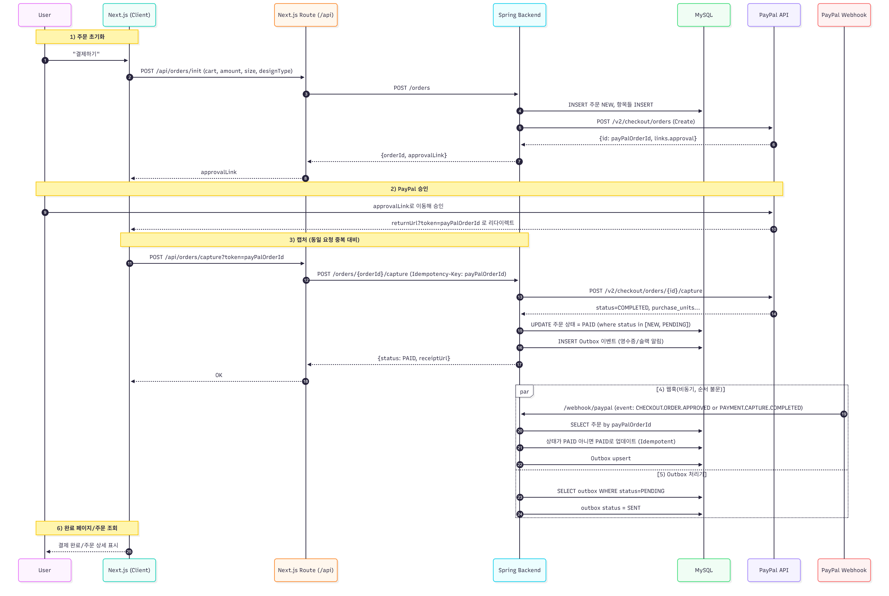
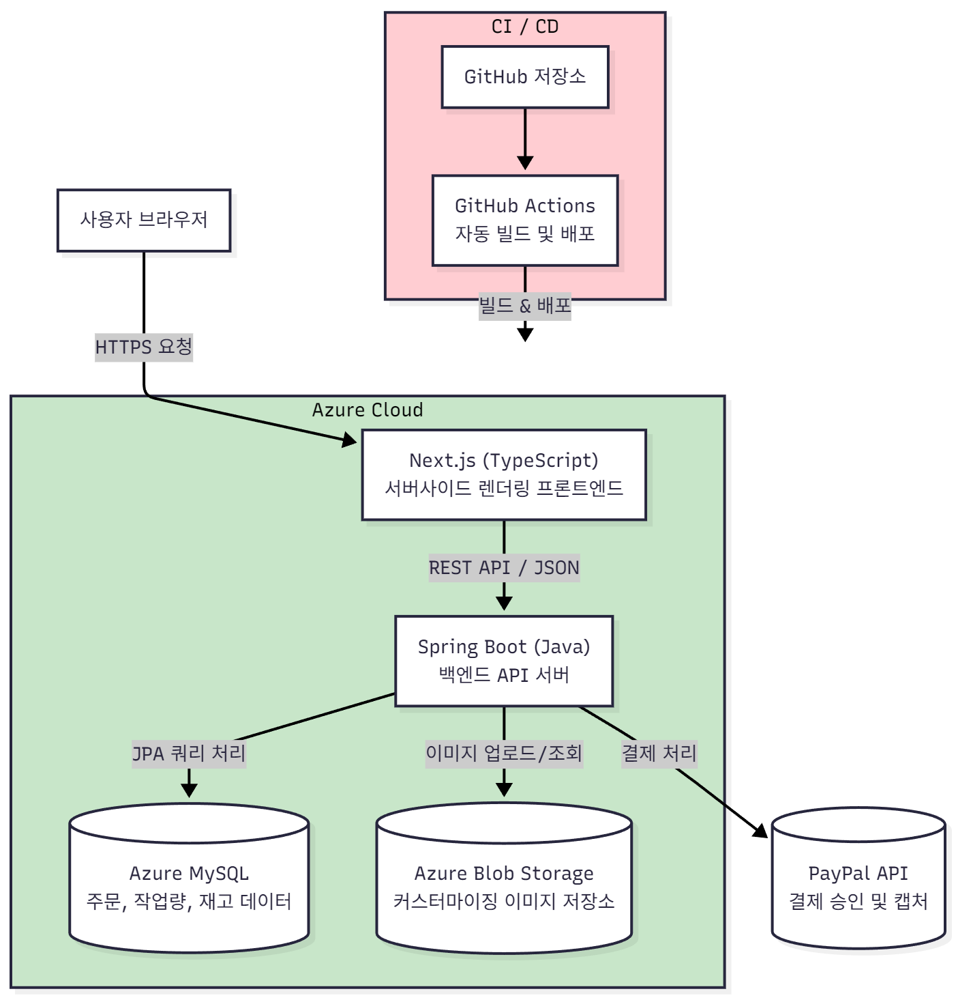

# Mydea (마이디)

3D 시뮬레이션을 통한 비즈 악세사리 제작 (가상) 쇼핑몰

---

## 개요
Mydea(마이디)는 사용자가 직접 비즈색상을 선택하고, 디자인을 조합해 액세서리를 실시간 3D로 커스터마이징하고 주문할 수 있는 웹 서비스입니다.  
단순한 상품 선택이 아닌, 나만의 아이디어(My Idea)가 실제 제품으로 완성되는 과정을 시각적으로 경험할 수 있도록 설계했습니다.

---

## 기획 배경
전 직장에서의 유통 도메인 경험을 살려서 e-commerce 서비스를 개인 프로젝트로 구현해보고 싶었습니다.  
또한 단순한 쇼핑몰이 아닌, 사용자의 불편함을 해결해주는 저만의 아이디어가 담긴 프로젝트를 만들고 싶었습니다.  

평소 비즈 악세사리를 좋아해서 직접 만들어본 적이 있지만, 손재주가 부족해 항상 마감이 아쉬웠던 기억이 있었는데,  
그때 ‘내가 디자인한 악세사리를 대신 만들어주는 서비스가 있으면 좋겠다’라는 생각을 했고, 그때의 기억이 이번 프로젝트의 출발점이 되었습니다.  

또한 학부 시절 D3.js로 데이터 시각화 프로젝트를 했던 경험을 떠올리며, 비슷한 개념으로 3D 형태를 직접 다룰 수 있는 Three.js를 활용해 사용자 커스터마이징 기능을 구현하게 되었습니다.

---

## 개발 기간
- 2025.09.01 ~ 2025.10.28 : 메인 기능 개발 완료  
- 2025.11.01 ~ 현재 : 부가 기능 구현 및 리팩토링 진행 중

---

## 인원
- 1명 (개인 프로젝트)

---

## 주소

- **배포 주소:** [https://mydea.co.kr](https://mydea.co.kr)
---

## 기술 스택

### 백엔드
- Spring Boot (Java) : RESTful API 기반 서버 구현  
- JPA : ORM으로 객체지향적 DB 설계  
- Spring Security + JWT : 무상태 인증 구조 구현  
- Flyway : DB 버전 관리 및 마이그레이션 이력 추적

### 데이터베이스
- MySQL (Azure DB) : 주문, 재고, 작업량 등 주요 데이터 관리  
- Azure Blob Storage : 커스터마이즈 악세사리의 이미지 파일 업로드 및 관리

### 프론트엔드
- Next.js (React + TypeScript) : 서버사이드 렌더링으로 보안성과 구조적 라우팅 확보,  
  리액트 상태관리를 통해 사용자의 설정을 3D 뷰어에 실시간 반영  
- Three.js + React Three Fiber (R3F) : 실시간 3D 렌더링 및 비즈 커스터마이징 구현

### CI / CD
- Azure App Service : 클라우드 호스팅 및 운영  
- GitHub Actions : 자동 빌드 및 배포 파이프라인 구축

---

## 주요 기능

### 1. 3D 커스터마이징
- three.js를 사용해서 도형의 배치를 악세사리처럼 구현  
- 비즈의 색상 조합과 전체 사이즈를 조절하며 실시간 미리보기 제공  
- 사용자가 선택한 비즈 색상의 개수에 따라 가능한 사이즈를 계산하여 옵션으로 제공  

### 2. 작업물 저장 및 관리
- 저장버튼 클릭 시, 사용자 설정값을 저장(수정)한 후, 미리보기 이미지를 캡처 업로드 요청  
- 응답 URL을 Patch 요청으로 수정  
- API에서는 쓰기/읽기 서비스를 분리하고 도메인 검증을 통해 데이터 일관성 보장  
- 이미지 접근은 SAS 서명 URL(1시간 TTL)으로 안전하게 노출  

### 3. 장바구니
- 작업물이 수정되어도 기존 장바구니 내용이 유지되어야 하므로 설정값을 JSON 형식으로 저장  
- 같은 상품 추가 시 수량이 증가해야 하므로 workId와 설정값으로 구분  
- 장바구니에 넣지 않고 즉시 주문하는 로직을 위해 일회성 virtual 장바구니 데이터 사용  

### 4. 주문 및 결제 프로세스
- 사용자가 장바구니 또는 바로구매로 주문 생성  
- 서버에서 주문데이터 생성 후 PayPal 승인 링크를 프론트에 전달  
- 프론트에서 서버로 결제 요청 전송 (Idempotency 키 포함하여 중복 결제 방지)  
- 서버에서 PayPal Order API의 Capture 엔드포인트를 호출하여 결제 확정  
- 응답 결과에 따라 주문/결제의 상태 갱신 (결제 완료/실패)  
- 추후 PayPal 웹훅을 통해 이벤트를 수신하여 최종 상태 동기화  

---

## 스크린샷

### 기본 반지 제작 화면

### 꽃 팔찌 제작 화면

### 저장 목록

---
---
## 시스템 구조도

---

## 구현 및 문제 해결

### 커스터마이징 기능 구현

#### ▪ 도형 선정
three.js에서 제공하는 기본 도형 중 비즈와 유사한 형태를 찾는 것이 쉽지 않았습니다.  
처음에는 구(Sphere)를 납작하게 변형하거나 원기둥에 구멍을 뚫는 방식을 시도했으나  
모서리와 구멍을 곡선으로 부드럽게 표현하기가 어려웠습니다.  

공식 문서의 시뮬레이터를 활용하여 다양한 도형의 설정값을 실험한 결과,  
도넛 형태의 TorusGeometry가 실제 비즈와 가장 유사해 보여 선택하게 되었습니다.

#### ▪ 원형 배치
비즈를 원 형태로 배치하기 위해 전체 개수(count)에 따라 각 비즈의 각도(원 중심으로부터의 위치 각도)를  
`t = i / count * 2π` 로 계산하고, 각 비즈의 좌표를  
 x = ringRadius * cos(t)
 z = ringRadius * sin(t)
 로 설정하여 원주를 따라 균등하게 배치했습니다.

#### ▪ 접선 방향 정렬
각 비즈의 구멍이 원의 접선 방향을 향하도록 비즈의 로컬 축(upAxis)을  
원의 접선 벡터 T(t)에 일치시키는 회전 변환을 적용했습니다.  
이를 위해 Quaternion의 setFromUnitVectors(upAxis, T(t)) 함수를 사용하여  
모든 비즈가 자연스럽게 원의 방향에 맞추어 회전하도록 구현하였습니다.

#### ▪ 꽃 모양 악세사리 구현
비즈공예에서 꽃 모양의 반지나 팔찌를 만들 때,  
중심 비즈 1개를 다른 색의 비즈 6개가 감싸도록 하는 방식을 사용합니다.  
이를 구현하기 위해 원 위의 임의의 각도에서 국소 좌표계를 만들고,  
그 평면 위에 꽃잎을 일정하게 배치하는 방식을 사용했습니다.

---

### 결제 안정성 문제

#### ▪ Idempotency 키 사용
결제 요청 시, 클라이언트에서 서버로 Idempotency-Key 헤더를 전달하여 중복 결제를 방지했습니다.

#### ▪ Outbox / Inbox 패턴 적용
PayPal Capture 요청은 Outbox 이벤트로 관리하여 실패 시 자동 재시도하도록 했습니다.  
PayPal 웹훅은 Inbox를 통해 중복 이벤트를 제거하고, Payment/Order 상태를 PSP와 최종 합의하도록 설계했습니다.

#### ▪ 트랜잭션 및 로깅 관리
각 결제 시도는 OrderAttemptLog에 별도 트랜잭션(REQUIRES_NEW)로 기록하여 장애를 추적할 수 있도록 했습니다.

---

### 주문 목록 조회 시 N+1 문제 발생
주문 목록 조회 시 주문 상세 엔티티와의 매핑 관계로 인해 N+1 문제가 발생했습니다.  
fetch join을 사용하면 페이지네이션과 충돌이 발생할 우려가 있었기 때문에, EntityGraph를 사용하여 문제를 해결했습니다.  

리포지토리 메서드에 EntityGraph를 적용해 자식 엔티티(items)를 즉시 로딩 대상으로 지정하고,  
batch_fetch_size = 100으로 설정하여 컬렉션 로딩 시 여러 식별자를 IN 쿼리로 묶어 조회하도록 개선했습니다.
