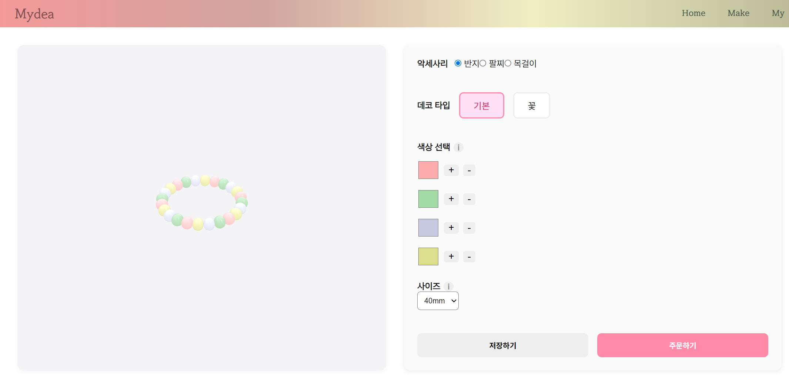
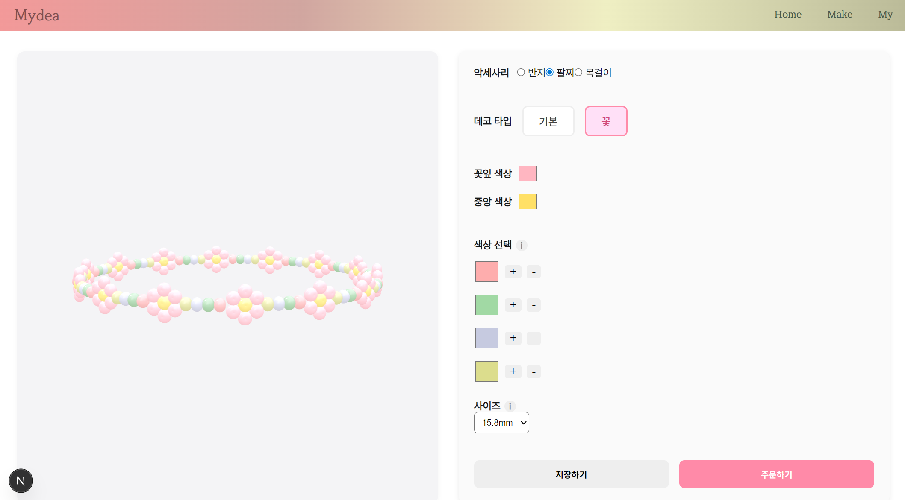
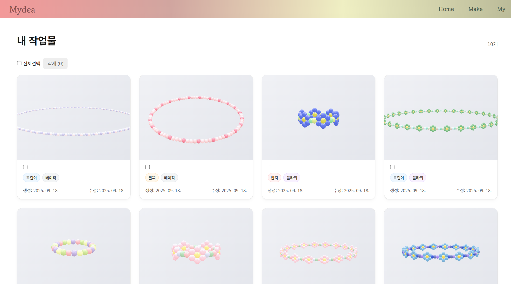

# Mydea

3D 시뮬레이션을 통한 비즈 악세사리 제작 (가상) 쇼핑몰

Mydea는 사용자가 직접 색상을 선택하고, 다양한 데코 타입을 적용하여  
비즈 반지, 팔찌, 목걸이 등을 3D 시뮬레이션으로 제작해볼 수 있는 프로젝트입니다.  
현재는 기본 패턴과 꽃 패턴의 반지,팔찌,목걸이를 제작할 수 있습니다.  

- 기간 : 2025년 9월 ~ 10월
- 배포 주소 : https://mydea.co.kr
  * [방문자용 로그인] 클릭 시 자동 로그인 됩니다.

---

## 주요 기능
- 비즈 색상, 데코 타입 등의 설정을 통한 악세사리 커스터마이징
- 커스터마이징 설정 값 저장
- 장바구니
- 회원가입 및 로그인

---

## 스크린샷

### 기본 반지 제작 화면

### 꽃 팔찌 제작 화면

### 저장 목록

---

## 기술 스택
- Frontend : Next.js, React Three Fiber, TypeScript  
- Backend : Spring Boot, MySQL (Azure)  
- Deployment : Azure  

---

## 구현 예정 기능
- 주문 관리  
- 디자인 공유 및 커뮤니티 기능

---

